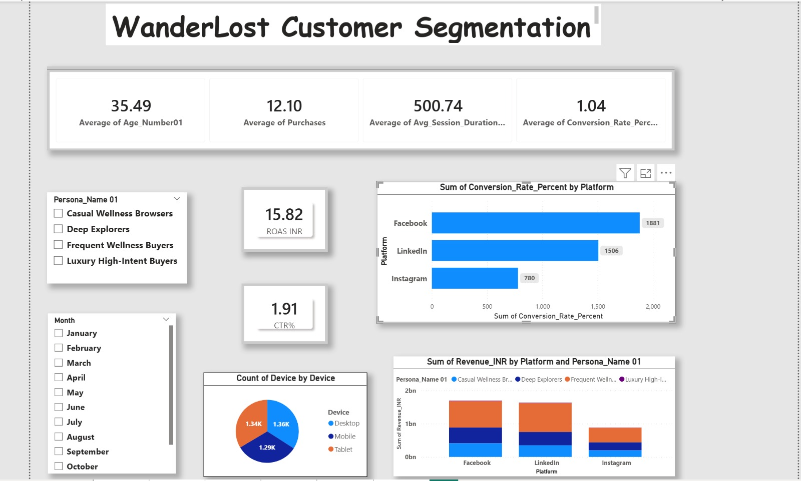
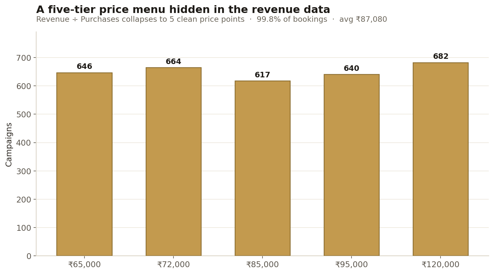
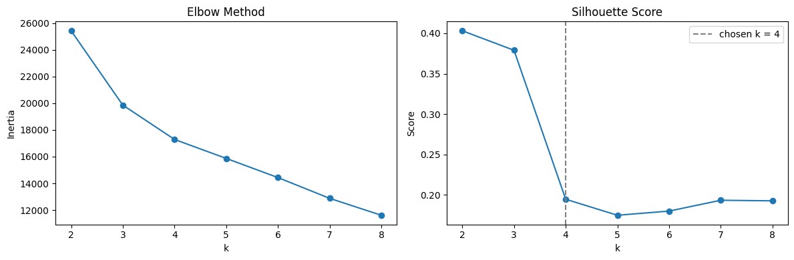
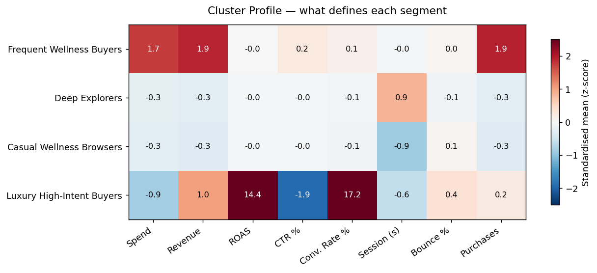
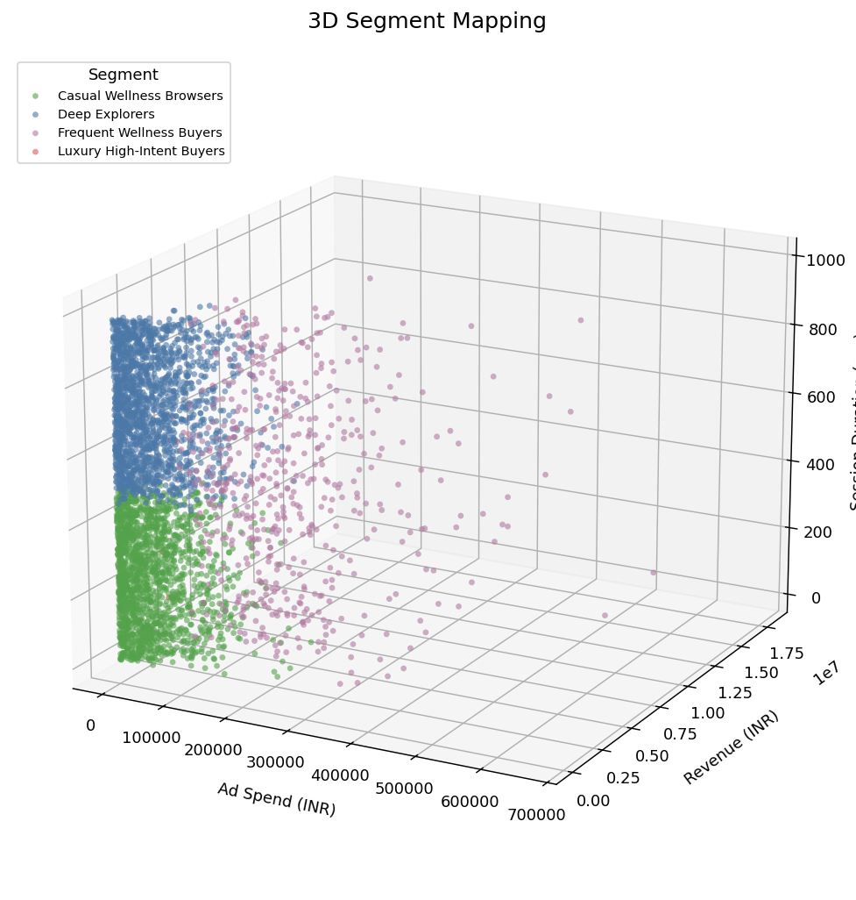

# WanderLost — Customer Persona Segmentation & Marketing Strategy

[](https://colab.research.google.com/github/HimanshuKarmakar/wanderlost-persona-segmentation/blob/main/WanderLost_Persona_Segmentation.ipynb)


*An unsupervised machine-learning project that segments 4,000 advertising campaigns into behavioural groups, with a data-grounded read on what drives revenue — and where the model's limits lie.*



---

## Overview

WanderLost is a premium travel-retreats brand (fictional, used here for demonstration). This project applies K-Means clustering to a dataset of 4,000 advertising campaigns to identify behavioural segments and assess what separates the high-revenue campaigns from the rest. It is a **methods and communication showcase on simulated data**, not a source of real-world customer insight. Findings are explored in a Python notebook and visualised in an interactive Power BI dashboard.

> All data is simulated for demonstration purposes. No real company or customer data is used.

---

## Key Findings

| Segment | Revenue | Share | ROAS | Converted |
|---|---:|---:|---:|---:|
| Frequent Wellness Buyers | ₹2,104M | ~50% | 19.93× | 100% |
| Deep Explorers | ₹1,116M | ~26% | 13.18× | 79% |
| Casual Wellness Browsers | ₹964M | ~23% | 12.67× | 78% |
| Luxury High-Intent Buyers *(outliers, n = 11)* | ₹28.56M | <1% | 3,232×* | 100% |

<sub>*The Luxury High-Intent Buyers ROAS is driven by 11 extreme-ratio outlier campaigns and is excluded from strategic conclusions (see below).</sub>

- **Revenue is highly concentrated.** Frequent Wellness Buyers are 13% of campaigns but drive ~50% of total revenue at 100% conversion.
- **The segmentation mainly reflects conversion and engagement.** Frequent Wellness Buyers and the outlier group convert at 100%; the two larger segments (~78% conversion) are distinguished almost entirely by session length (~12 min vs ~4 min) rather than any other behaviour.
- **A small outlier pocket distorts the headline ROAS.** Eleven campaigns show extreme ROAS on negligible spend; these are treated as noise, not a segment.

---

## Strategic Recommendation

The clearest data-supported action is to **concentrate budget and creative on Frequent Wellness Buyers**, who drive roughly half of revenue at full conversion and show a mild LinkedIn skew (41% of impressions vs 39% Facebook — the only segment where LinkedIn leads).

Beyond that, channel- and demographic-level targeting should be treated as **hypotheses to validate through controlled A/B tests**, not conclusions: in this dataset the platform and age columns are near-uniform across segments, so they provide no reliable targeting signal on their own.

---

## Customer Segments

> **Read this first.** The model clusters on **behavioural and financial features only**. Segment *names and motivations are interpretive overlays.* The channel (Platform) and demographic (Age) columns are roughly uniform across segments, so any segment-level channel or demographic claim is a hypothesis to be tested — not a finding. The segmentation primarily separates campaigns by **conversion outcome, revenue magnitude, and session duration** (see the cluster profile below).

**Frequent Wellness Buyers (n = 535) — the revenue engine**
- *Data:* highest spend, revenue, and purchases; 100% conversion; ~50% of total revenue. Mild LinkedIn skew (41% vs 39% Facebook).
- *Interpretation (hypothesis):* high-value, high-intent buyers — to be validated against first-party data.

**Deep Explorers (n = 1,770) — long-session, lower-value**
- *Data:* ~26% of revenue, 79% conversion, the longest sessions (~12 min mean). Otherwise near-identical to Casual Wellness Browsers.
- *Interpretation (hypothesis):* methodical browsers who research thoroughly before converting.

**Casual Wellness Browsers (n = 1,684) — short-session, lower-value**
- *Data:* ~23% of revenue, 78% conversion, the shortest sessions (~4 min mean). Session length is essentially the *only* feature separating this group from Deep Explorers.
- *Interpretation (hypothesis):* quick, impulse-style sessions.

**Luxury High-Intent Buyers (n = 11) — outlier group**
- *Data:* 11 campaigns with extreme ROAS (≈1,200×–18,000×) on negligible spend — statistical outliers, not a stable segment. Excluded from strategic conclusions.

---

## Pricing Signal — the data encodes a price ladder

Beyond the clustering, the revenue data hides a clean structural signal. Dividing `Revenue_INR` by `Purchases` for every converting campaign collapses to a **discrete five-tier price menu** — not a continuous spread — recovering the exact prices the simulated data was generated from:

| Price per booking | Campaigns |
|---:|---:|
| ₹65,000 | 646 |
| ₹72,000 | 664 |
| ₹85,000 | 617 |
| ₹95,000 | 640 |
| ₹1,20,000 | 682 |



These five tiers cover **99.8%** of all converting campaigns. Across the full dataset:

- **Booking-weighted average price (AOV):** ₹87,080
- **Total bookings (guests served):** 48,382
- **Total revenue / spend:** ₹4.21B on ₹266.3M (blended ROAS 15.82×)

Because the dataset is simulated, this division effectively recovers the **price list the generator drew from** — a useful integrity check (revenue is internally consistent with a fixed menu rather than arbitrary), and a ready-made price ladder for the brand: a ₹65,000 entry stay, a ~₹95,000 flagship, and a ₹1,20,000 top tier. On real-world data the same computation would instead *estimate* average order value, since prices, discounts, and basket sizes vary per transaction.

Reproduce it with [`pricing_analysis.py`](pricing_analysis.py):

```bash
python pricing_analysis.py
```

> These are generated price points, not observed market prices — they describe the data's design, not customer behaviour.

---

## Methodology

1. **Data validation** — confirmed zero null values and zero duplicate records across 28 columns.
2. **Feature selection** — eight behavioural signals: `Spend_INR`, `Revenue_INR`, `ROAS`, `CTR_Percent`, `Conversion_Rate_Percent`, `Avg_Session_Duration_Sec`, `Bounce_Rate_Percent`, `Purchases`.
3. **Standardisation** — applied `StandardScaler` so that high-magnitude features such as revenue do not dominate the distance calculation.
4. **Clustering** — `KMeans(n_clusters=4, random_state=42)`.
5. **Profiling and visualisation** — examined each cluster's standardised feature profile (heatmap), then mapped clusters to named segments.

> **On the choice of k = 4:** the elbow flattens around k = 3–4, while silhouette favours fewer clusters (≈0.40 at k = 2 vs ≈0.20 at k = 4). Four clusters were chosen for interpretability rather than to maximise a separation metric; one of the four turns out to be a small outlier pocket.



---

## Dataset

A simulated, India-localised dataset of advertising-campaign performance in Meta Ads format, comprising **4,000 rows and 28 columns**. Fields include campaign metadata, audience demographics (age, gender, location), and the full performance funnel (impressions, clicks, add-to-cart, purchases), together with revenue, ROAS, bounce rate, and session duration.

---

## Visualisations

The clearest view of the segmentation is the **cluster profile** — the standardised mean of each feature per segment:



Frequent Wellness Buyers stand out on spend, revenue, and purchases; the two larger segments differ almost entirely on session duration; and the outlier group is defined by extreme ROAS and conversion rate.

A 3D scatter (Spend × Revenue × Session Duration) gives a complementary view:



These render statically on GitHub; open the notebook in Colab to explore them interactively.

---

## Power BI Dashboard

An interactive Power BI dashboard (shown at the top of this README) accompanies the analysis, with slicers for segment, month, and platform; KPI cards (ROAS, CTR, average session duration, conversion rate); and revenue and conversion breakdowns by platform and device.

- **File:** [`WanderLost.pbix`](WanderLost.pbix) — open in Power BI Desktop to interact with the slicers.
- **Live version:** *(optional)* publish via Power BI Service → "Publish to web", then add the public link here.

---

## Skills Demonstrated

- Data cleaning and integrity validation
- Feature selection, standardisation, and cluster profiling
- Unsupervised machine learning (K-Means clustering)
- Honest interpretation — separating what the data supports from interpretive narrative
- Translating analysis into a measured, testable business recommendation
- Data visualisation across Python (heatmap, 3D scatter) and Power BI (interactive dashboard)
- Recovering pricing structure (a discrete price ladder and AOV) from transactional revenue data

---

## Tech Stack

Python · pandas · NumPy · scikit-learn · Plotly · Matplotlib · Power BI · Google Colab

---

## Getting Started

**Run in Google Colab (recommended):** open the notebook using the badge at the top of this page.

**Run locally:**
```bash
git clone https://github.com/HimanshuKarmakar/wanderlost-persona-segmentation.git
cd wanderlost-persona-segmentation
pip install -r requirements.txt
jupyter notebook
```

---

## Project Structure

```
wanderlost-persona-segmentation/
├── README.md
├── LICENSE
├── requirements.txt
├── WanderLost_Persona_Segmentation.ipynb
├── pricing_analysis.py
├── WanderLost.pbix
├── WanderLost_Cleaned.csv
├── powerbi-dashboard.jpg
├── cluster-profile-heatmap.png
├── price-tiers.png
├── elbow-silhouette.png
├── 3d-persona-map.png
├── 3d-persona-map.html
└── index.html          # brand landing page (served via GitHub Pages)
```

---

## Limitations & Future Work

- **Simulated data** — every result is an artifact of the data generator, not real-world performance. This is a methods and communication showcase.
- **Circular by construction** — segments are defined by financial and engagement features, so differences in those metrics are expected; the segmentation adds limited signal beyond revenue magnitude and session length.
- **Narrative vs evidence** — segment-level channel and demographic claims are *not* supported by the Platform and Age columns (which are uniform across segments) and are stated as hypotheses only.
- **Outlier cluster** — the Luxury High-Intent Buyers group is 11 outliers; K-Means and `StandardScaler` are both outlier-sensitive, so `RobustScaler` or winsorising would be more robust.
- **Feature redundancy** — `Revenue` and `Purchases` correlate at 0.96, and `ROAS` correlates ≈0 with the others; a cleaner pass would drop a redundant feature and reconsider `ROAS`.
- **Cluster count** — silhouette favours k = 2; k = 4 is an interpretability choice.

*Future work:* drop the redundant feature and re-run; validate segment channel/demographic hypotheses with A/B tests; train a classifier to assign new campaigns to a segment; deploy the dashboard via Power BI Service for a live link.

---

## Author

**Himanshu Karmakar**  ·  
[GitHub](https://github.com/HimanshuKarmakar)  ·  
[WanderLost](https://himanshukarmakar.github.io/Wanderlost/)

Released under the MIT License.
